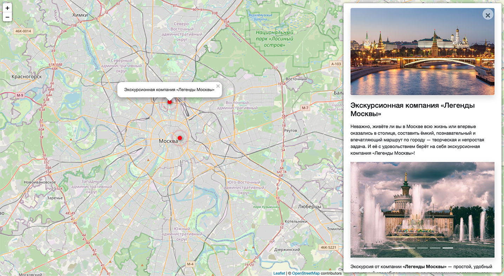

# Куда пойти

Сайт о самых интересных местах в Москве.



[Демо-версия сайта](https://tobeadded)

## Запуск

Для запуска сайта вам понадобится Python 3.

Скачайте код с GitHub. Установите зависимости:

```sh
pip install -r requirements.txt
```

Создайте базу данных SQLite

```sh
python3 manage.py migrate
```

Запустите сервер разработчика

```sh
python3 manage.py runserver
```

## Переменные окружения

Часть настроек проекта берётся из переменных окружения. Чтобы их определить, создайте файл `.env` рядом с `manage.py` и запишите туда данные в таком формате: `ПЕРЕМЕННАЯ=значение`.

Доступны три переменные:

- `DEBUG` — дебаг-режим. Поставьте `True`, чтобы увидеть отладочную информацию в случае ошибки.
- `SECRET_KEY` — секретный ключ проекта
- `DATABASE_NAME` — путь до базы данных, например: `places.sqlite3`

### Используемые библиотеки

- [Leaflet](https://leafletjs.com/) — отрисовка карты
- [loglevel](https://www.npmjs.com/package/loglevel) – логирование
- [Bootstrap](https://getbootstrap.com/) — CSS библиотека
- [Vue.js](https://ru.vuejs.org/) — реактивные шаблоны на фронтенде

### Цель проекта

Код написан в образовательных целях на онлайн-курсе для веб-разработчиков [dvmn.org](https://dvmn.org/).

Тестовые данные взяты с сайта [KudaGo](https://kudago.com).
